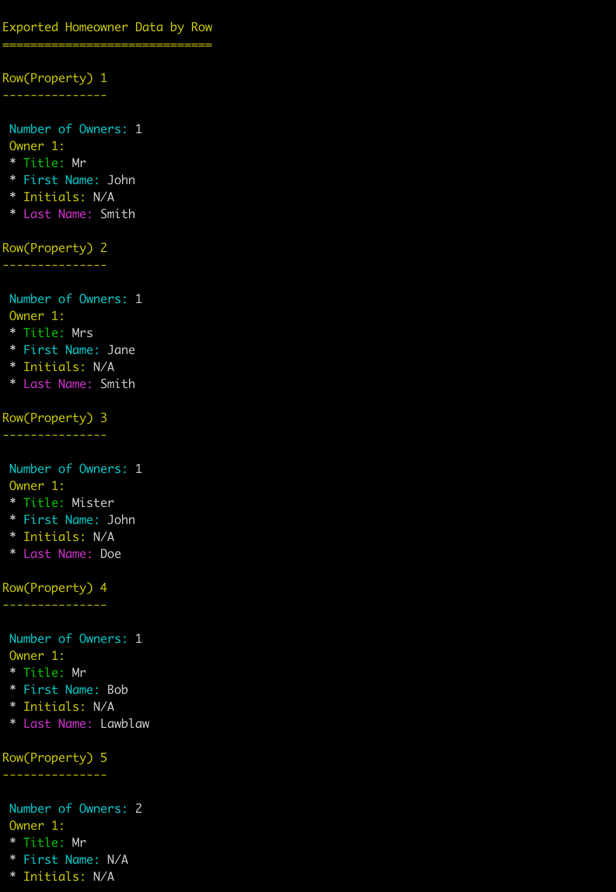

# Homeowner Name Parser

This project processes homeowner data from a CSV file, parsing names into structured fields such as title, first name, initial, and last name. The code is designed to handle various formats of input names, including complex cases with initials, multiple titles, and shared last names.

---

## Features

- Parses names into structured components: `title`, `first_name`, `initial`, and `last_name`.
- Handles edge cases such as:
    - Names with "and" or "&" (e.g., `"Mr and Mrs Smith"`).
    - Initials (e.g., `"Mr F. Fredrickson"`).
    - Missing components (e.g., `"Mrs Smith"`).
- Gracefully handles unexpected input with robust error handling.
- Modular design for scalability and maintainability.

---

## Installation

### Requirements

- **PHP:** 8.2+
- **Composer**
- **Laravel Framework**
- **Docker and Docker Compose** (optional, for running in containers)

### Installation Steps

#### Option 1: Using Docker (Recommended)

If you have Docker installed, you can run the project without manually setting up Laravel:

1. Clone the repository:
   ```bash
   git clone https://github.com/soleinjast/homeowner-parser.git
   cd homeowner-parser
   ```

2. Start the application using Docker Compose:
   ```bash
   docker-compose up
   ```

3. You can now run Artisan commands or process the CSV file inside the Docker container (details below).

#### Option 2: Manual Laravel Setup

1. Clone the repository:
   ```bash
   git clone https://github.com/your-username/homeowner-parser.git
   cd homeowner-parser
   ```

2. Install dependencies:
   ```bash
   composer install
   ```

3. Set up Laravel:
    - Copy `.env.example` to `.env`:
      ```bash
      cp .env.example .env
      ```
    - Generate the application key:
      ```bash
      php artisan key:generate
      ```

4. Place your CSV file in the `storage` directory or provide the file path when running the command.

---

## Modular Programming Approach

The project follows a **modular programming** architecture for better scalability and maintainability. Each module is self-contained and encapsulates its logic, making it easy to extend or modify.

### Benefits of Modular Design:

- **Separation of Concerns:** Each module focuses on a specific feature or functionality.
- **Ease of Maintenance:** Modules can be updated independently without affecting other parts of the application.
- **Scalability:** New features can be added by introducing new modules.
- **Testability:** Each module can be individually tested.

### File Structure:

```plaintext
modules/
├── HomeownerProcessor/
│   ├── Commands/         # Artisan commands for processing homeowners
│   ├── Core/             # Core module functions
│   ├── Enumerations/     # Constants or enums used in the module
│   ├── Exceptions/       # Custom exceptions
│   ├── Providers/        # Service providers for the module
│   ├── Services/         # Business logic for parsing and processing data
│   ├── Tests/            # Unit & integration and E2E tests for the module
```

---

## Running the Project

You can run the project in two ways:

### 1. Using Laravel's Built-In Server

Run the following command to start the server:

```bash
php artisan serve
```

This will start the application on `http://127.0.0.1:8000`.

### 2. Using Docker

If you have Docker installed, you can run the project with `docker-compose`:

```bash
docker-compose up
```

This will spin up the required services:
- **Laravel App Container (`laravel_app`)**: The main PHP application server.

---

## File Location

The file `examples-284-29-1-.csv` (which was associated with assessment) is included in the root of this project as part of the assessment.

- **For Local Use:** The file is located in the root directory of the project. You can use it directly by specifying the relative path `examples-284-29-1-.csv` in your commands.
- **For Docker Use:** Inside the Docker container, the file is located at the path `/var/www/html/examples-284-29-1-.csv`. You can use this path to reference the file when running commands inside the container.

---

## Structured Homeowner Data Parser Command

This command processes the included CSV file located in the container at /var/www/html/examples-284-29-1-.csv and outputs the parsed names to the console.

### Running Artisan Commands
Use the `docker exec` command to access the Laravel container (`laravel_app`) and execute Artisan commands:

```bash
docker exec -it laravel_app php artisan homeowners:process /var/www/html/examples-284-29-1-.csv
```

Or if you are not using docker:

```bash
php artisan homeowners:process /var/www/html/examples-284-29-1-.csv
```

---

## Testing

### Test Cases

The parser has been tested with the following scenarios:

1. **Simple Names:** `"Mr John Smith"`, `"Mrs Jane Doe"`
2. **Initials:** `"Dr P. Gunn"`, `"Mr F. Fredrickson"`
3. **Multiple Names:** `"Mr and Mrs Smith"`, `"Dr & Mrs Joe Bloggs"`
4. **Edge Cases:** Empty strings, missing components.

### Running Tests

To run tests locally without Docker:

```bash
php artisan test
```

Or within Docker:

```bash
docker exec -it laravel_app php artisan test
```
This will execute all 40 (unit, integration and E2E tests) provided tests in project.


---

## Examples

### Input

Sample `examples-284-29-1-.csv` file content:

```csv
homeowner
Mr John Smith
Mrs Jane Smith
Mister John Doe
Mr Bob Lawblaw
Mr and Mrs Smith
Mr Craig Charles
Mr M Mackie
Mrs Jane McMaster
Mr Tom Staff and Mr John Doe
Dr P Gunn
Dr & Mrs Joe Bloggs
Ms Claire Robbo
Prof Alex Brogan
Mrs Faye Hughes-Eastwood
Mr F. Fredrickson
```

### Command

For local use:

```bash
php artisan homeowners:process examples-284-29-1-.csv
```

For Docker use:

```bash
docker exec -it laravel_app php artisan homeowners:process /var/www/html/examples-284-29-1-.csv
```

### Output

*Note: The JSON output formatted this way for better readability.*

```json
[
    {
        "row": 1,
        "number_of_owners": 1,
        "owners": [
            {
                "title": "Mr",
                "first_name": "John",
                "initial": null,
                "last_name": "Smith"
            }
        ]
    },
    {
        "row": 2,
        "number_of_owners": 1,
        "owners": [
            {
                "title": "Mrs",
                "first_name": "Jane",
                "initial": null,
                "last_name": "Smith"
            }
        ]
    },
    {
        "row": 3,
        "number_of_owners": 1,
        "owners": [
            {
                "title": "Mister",
                "first_name": "John",
                "initial": null,
                "last_name": "Doe"
            }
        ]
    },
    {
        "row": 4,
        "number_of_owners": 1,
        "owners": [
            {
                "title": "Mr",
                "first_name": "Bob",
                "initial": null,
                "last_name": "Lawblaw"
            }
        ]
    },
    {
        "row": 5,
        "number_of_owners": 2,
        "owners": [
            {
                "title": "Mr",
                "first_name": null,
                "initial": null,
                "last_name": "Smith"
            },
            {
                "title": "Mrs",
                "first_name": null,
                "initial": null,
                "last_name": "Smith"
            }
        ]
    },
    {
        "row": 6,
        "number_of_owners": 1,
        "owners": [
            {
                "title": "Mr",
                "first_name": "Craig",
                "initial": null,
                "last_name": "Charles"
            }
        ]
    },
    {
        "row": 7,
        "number_of_owners": 1,
        "owners": [
            {
                "title": "Mr",
                "first_name": null,
                "initial": "M",
                "last_name": "Mackie"
            }
        ]
    },
    {
        "row": 8,
        "number_of_owners": 1,
        "owners": [
            {
                "title": "Mrs",
                "first_name": "Jane",
                "initial": null,
                "last_name": "McMaster"
            }
        ]
    },
    {
        "row": 9,
        "number_of_owners": 2,
        "owners": [
            {
                "title": "Mr",
                "first_name": "Tom",
                "initial": null,
                "last_name": "Staff"
            },
            {
                "title": "Mr",
                "first_name": "John",
                "initial": null,
                "last_name": "Doe"
            }
        ]
    },
    {
        "row": 10,
        "number_of_owners": 1,
        "owners": [
            {
                "title": "Dr",
                "first_name": null,
                "initial": "P",
                "last_name": "Gunn"
            }
        ]
    },
    {
        "row": 11,
        "number_of_owners": 2,
        "owners": [
            {
                "title": "Dr",
                "first_name": null,
                "initial": null,
                "last_name": "Bloggs"
            },
            {
                "title": "Mrs",
                "first_name": "Joe",
                "initial": null,
                "last_name": "Bloggs"
            }
        ]
    },
    {
        "row": 12,
        "number_of_owners": 1,
        "owners": [
            {
                "title": "Ms",
                "first_name": "Claire",
                "initial": null,
                "last_name": "Robbo"
            }
        ]
    },
    {
        "row": 13,
        "number_of_owners": 1,
        "owners": [
            {
                "title": "Prof",
                "first_name": "Alex",
                "initial": null,
                "last_name": "Brogan"
            }
        ]
    },
    {
        "row": 14,
        "number_of_owners": 1,
        "owners": [
            {
                "title": "Mrs",
                "first_name": "Faye",
                "initial": null,
                "last_name": "Hughes-Eastwood"
            }
        ]
    },
    {
        "row": 15,
        "number_of_owners": 1,
        "owners": [
            {
                "title": "Mr",
                "first_name": null,
                "initial": "F",
                "last_name": "Fredrickson"
            }
        ]
    }
]


```


---
## Readable Console Screenshot with Cleanly Formatted Output After Running Command!

---
## License

This project is licensed under the [MIT License](LICENSE).
